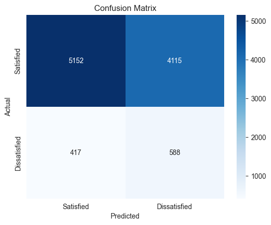

# Customer Satisfaction Prediction Task

## Overview
The objective of this task is to predict customer satisfaction by classifying customers as either satisfied or dissatisfied based on their demographic, transactional, and behavioral data. The project aims to improve customer retention by identifying factors contributing to dissatisfaction and devising data-driven interventions.

## Problem Statement
Currently, the prediction accuracy is limited due to several data challenges, including class overlap and data imbalance. The model's performance, based on an XGBoost classifier, achieved a recall of 58% and a precision of only 12%, indicating a significant number of false positives.

The main challenges include:
- **High Class Overlap**: Overlapping characteristics between satisfied and dissatisfied users make it difficult for the model to differentiate between the two groups.
- **Gender Imbalance**: There is a significant difference in the distribution of gender groups, potentially causing bias.
- **Data Quality Issues**: Inconsistent survey collection and missing values impact the analysis.
- **Behavioral Anomalies**: Users without recent purchases report high satisfaction, suggesting inconsistencies in the data.

## Recommendations
To improve the model's performance, several strategies are recommended:
1. **Data Expansion**: Collect more granular behavioral data, such as browsing activity, abandoned carts, sentiment analysis, and demographic details.
2. **Address Data Bias**: Investigate and correct potential gender bias in the dataset.
3. **User Segmentation**: Use clustering methods to group users based on similar characteristics and build specific models for each segment.
4. **Temporal Analysis**: Collect consistent temporal data to enable the application of time-series models and identify dissatisfaction trends.
5. **Anomaly Detection**: Apply anomaly detection models to better understand and address unexpected behaviors.

## Current Status
- The dataset includes survey responses, purchase data, delivery metrics, and session details for over 61,000 users.
- Significant preprocessing steps have been applied, including feature engineering, outlier removal, normalization, and handling missing values.
- A basic XGBoost model was trained on the processed data, achieving limited success in recall and precision.

## Key Findings
- **High Overlap**: There is substantial feature overlap between satisfied and dissatisfied users, complicating the classification.
- **Gender Imbalance**: There is a gender imbalance that might introduce bias, impacting model fairness.
- **Anomalies**: Users without recent purchases sometimes report high satisfaction, indicating potential data issues.
- **Survey Context**: Differences in survey responses from different platforms (Galaxus vs. Digitec) indicate behavioral differences based on the platform context.
- **Membership Length**: Users with a shorter membership duration (½ year) are more likely to be dissatisfied.

## Next Steps
1. **Data Collection**: Expand the data collection process to include more detailed and diverse user information.
2. **Feature Engineering**: Focus on adding features that represent user behavior in more detail, like temporal changes, purchase patterns, and sentiment analysis.
3. **Model Improvement**: Consider using different classification algorithms, such as LSTM for temporal analysis or hybrid models for improved segmentation.
4. **Bias Mitigation**: Address the potential bias in the dataset by exploring fairness measures and resampling techniques.
5. **Time-Series and Anomaly Modeling**: With more consistent temporal data, apply models like LSTM to capture trends over time and detect anomalies more effectively.

## Conclusion
The current dataset and features do not yet provide enough information to effectively predict customer dissatisfaction. Expanding the data collection, addressing biases, and applying more sophisticated modeling techniques will be essential steps for improving the model's performance. These improvements will help generate actionable insights to enhance customer satisfaction and retention.