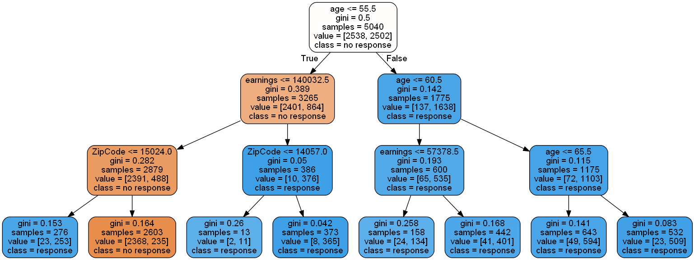

# Hotel Staff Size Prediction

## Problem Statement / Objective
The goal of this project is to build a regression model that recommends the optimal number of hotel staff for prospective buyers based on various hotel characteristics. By leveraging historical data, the model aims to provide data-driven guidance for staffing decisions in the hospitality domain.

## Dataset Description
The dataset `hotels_info.csv` contains the following columns:

- `Hotel Name`: Name or identifier of the hotel
- `m2`: Total area of the hotel in square meters
- `Age`: Age of the building in years
- `Max Number of Guests`: Maximum occupancy capacity
- `Number of Rooms`: Total number of rooms
- `Size of the Rooms`: Average size of the rooms
- `Staff`: Number of current staff (target variable)
- `Maintenance Cost`: Monthly maintenance cost in currency units

The data is a mix of numerical and categorical values and may include noise or irrelevant features requiring preprocessing.

## Approach / Solution Workflow
1. **Data Loading & Exploration**
   - Loaded data using pandas and examined data structure
   - Displayed summary statistics to understand feature distributions

2. **Feature Selection**
   - Selected features likely to correlate with staff size
   - Removed ID-like columns, high-cardinality non-informative features, and those with high multicollinearity

3. **Preprocessing**
   - One-hot encoding of categorical variables
   - Handled missing values (if any)
   - Train-test split: 60% training, 40% testing

4. **Modeling**
   - Trained a Ridge Regression model to predict staff size
   - Evaluated using the Pearson correlation coefficient on both train and test sets

5. **Model Tuning**
   - Adjusted the regularization parameter (`alpha`) to balance bias-variance trade-off
   - Visualized correlation vs. regularization strength

## Modeling & Evaluation
- **Model Used**: Ridge Regression
- **Metric**: Pearson correlation coefficient
- Observed model performance on both training and test sets to ensure generalization
- Identified optimal alpha value through experimentation

## Key Insights / Takeaways
- Features related to hotel capacity and services offered were strong predictors of staffing needs
- Proper regularization improved model generalization by avoiding overfitting
- Visualizing the regularization-performance curve revealed insights about bias vs. variance

## Technologies & Tools Used
- **Languages**: Python
- **Libraries**: pandas, numpy, matplotlib, sklearn
- **Techniques**: One-hot encoding, Ridge Regression, Pearson correlation

## Skills Demonstrated
- Exploratory Data Analysis
- Feature Engineering
- Regression Modeling
- Model Evaluation with Statistical Metrics
- Regularization Tuning and Interpretation
- Data Visualization for model diagnostics

## Future Improvements
- Experiment with nonlinear models like Random Forests or Gradient Boosted Trees
- Include external location-specific data (e.g., city population, tourism ratings)
- Convert to a web-based recommender using Streamlit or Flask
