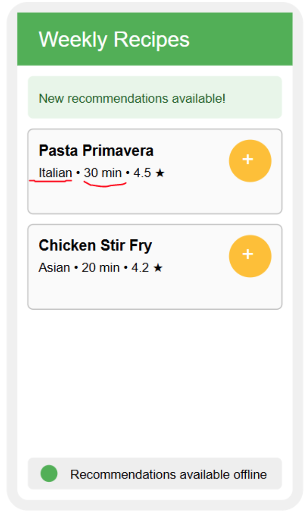
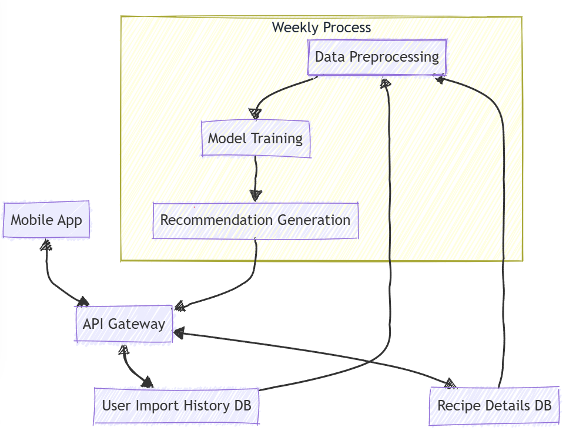
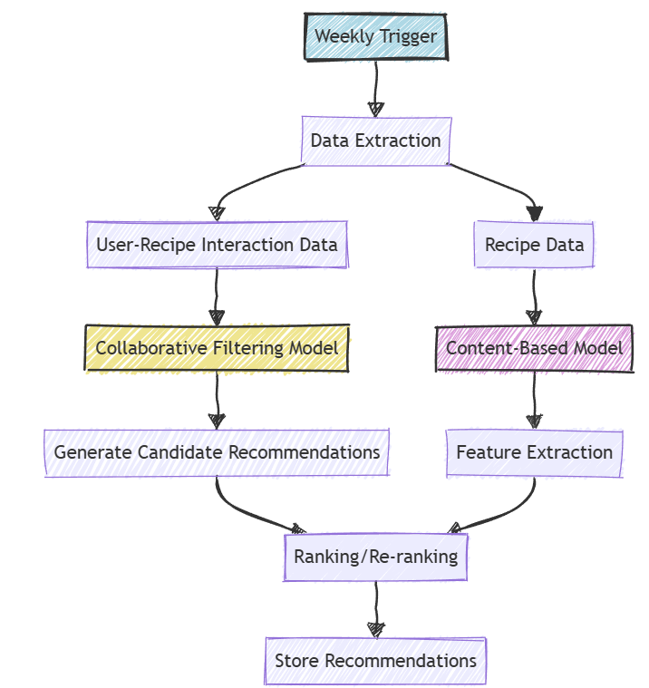
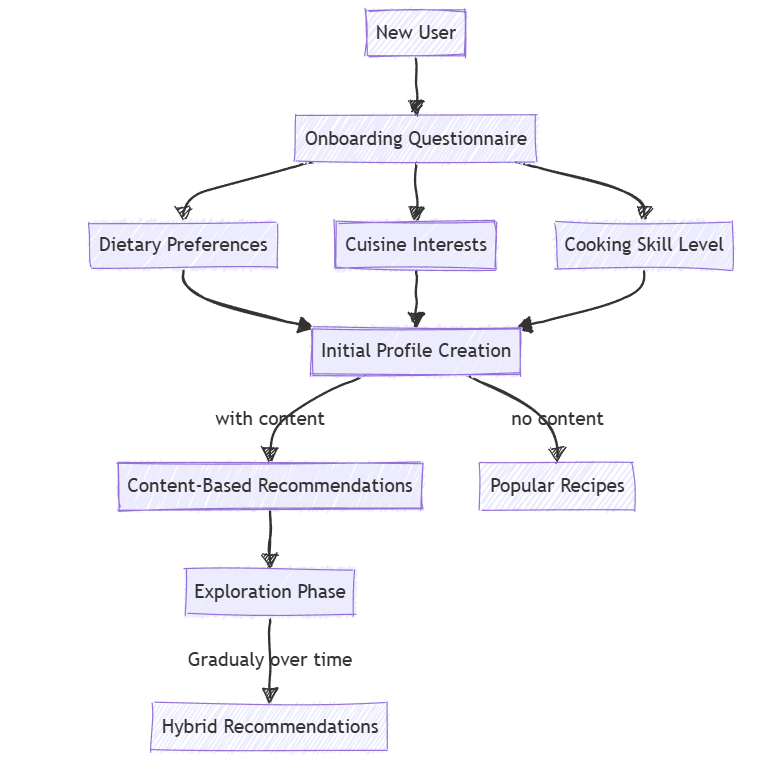

# Recipe Recommender System: System Design

## Overview

This mini project is a business proposal for a Recipe Recommender System, designed to be integrated into grocery list and meal planning apps. The aim is to enhance user engagement and retention by providing personalized weekly recipe recommendations, tailored to individual user behavior and preferences.

The proposal outlines a full system architecture, including data collection, machine learning modeling, and deployment strategies. The system uses user data to provide a smart, personalized experience that makes meal planning easy and fun.

## Key Features

- **Personalized Recipe Recommendations**: Recipes are tailored based on past user behavior, making suggestions more relevant.
- **Weekly Batch Processing for Efficiency**: Recommendations are updated weekly using a batch process, ensuring that updates are fresh but computationally efficient.
- **Integration with Existing Grocery List Functionality**: Recommendations can easily be added to users' grocery lists.
- **Scalable Architecture**: Designed to handle large user bases, utilizing big data technologies for efficient processing.

## System Design Overview

The system follows a modular design with the following key components:

1. **Data Collection and Storage**: Collect user interaction data and store it in a data lake (e.g., Amazon S3).
2. **Data Preprocessing**: Transform and clean data for use in model training.
3. **Recommendation Engine**: A hybrid model combining Collaborative Filtering (CF) and Content-Based Filtering for more effective suggestions.
4. **API Gateway and Mobile App Integration**: REST API endpoints for providing recommendations to a mobile app.
5. **Weekly Recommendation Process**: A scheduled process to generate personalized recommendations.

## Technical Highlights

### Data Pipeline and Processing
- **ETL Pipeline**: Utilizes an ETL process for extracting, transforming, and loading user-recipe interaction data. Data is stored in a data lake for easy scalability.
- **Data Processing**: Apache Spark is used for distributed processing to handle feature engineering and train models at scale.

### Model Research and Selection
- **Hybrid Recommendation Engine**: Combines Collaborative Filtering and Content-Based Filtering:
  - **Collaborative Filtering (CF)**: Captures user behavior patterns.
  - **Content-Based Filtering**: Uses attributes like ingredients, meal type, and cuisine type.
- **Evaluation Metrics**: Offline metrics (MAP, Precision@K, nDCG) and online metrics (CTR, Save Rate, Recipe View Time).

### Handling New Users - Cold Start Problem

To handle new users who do not have any historical data (commonly known as the cold start problem), the system incorporates the following strategies:
1. **Initial Profile Questionnaire**: When users first join, they are prompted to fill out a short questionnaire about their food preferences, dietary restrictions, and favorite cuisines. This helps create an initial profile for making recommendations.
2. **Popular Recipe Suggestions**: For new users, popular or trending recipes are recommended as a starting point until enough interaction data is gathered. These recipes are selected based on popularity among similar demographic groups.
3. **Content-Based Filtering**: The initial recommendations are generated using content-based filtering techniques, utilizing the user's stated preferences and any available demographic information (e.g., age, location, family status).
4. **Gradual Transition to Hybrid Model**: As users interact more with the app—saving recipes, providing feedback, or viewing specific types of meals—the system gradually transitions to the hybrid recommendation approach, which combines Collaborative Filtering and Content-Based Filtering to provide more accurate and personalized suggestions.

### Model Serving and Deployment
- **Model Registry and Serving**: Uses tools like MLflow to store and version models. Models are served via a REST API using frameworks like TensorFlow Serving.
- **API Integration**: FastAPI is used for building RESTful API endpoints to serve recommendations and collect user feedback.
- **Containerization**: Docker and Kubernetes are used for scalable deployment.

## Mobile App Integration
- **User Interface**: Recommended recipes are presented through a weekly notification. Users can browse a scrollable list of personalized recipe suggestions.
- **Feedback Mechanism**: Users can rate or save recipes, and implicit feedback (like views or ingredient additions) is collected for model improvement.
- **Offline Access**: Caching of recommendations allows offline access, enhancing usability.

## Potential Applications

This system is ideal for companies in the food tech space, especially those focusing on meal planning and grocery shopping apps. The recommender system will not only enhance the user experience by providing personalized content but also increase engagement and create new monetization opportunities through strategic partnerships.

## Future Improvements
- **Seasonality and Local Food Trends**: Incorporate seasonal and local preferences into recommendations.
- **Integration with Shopping Lists**: Recommend recipes based on the items already on a user's grocery list.
- **Nutritional Goals**: AI-powered meal planning based on personalized nutritional goals.

## Contents
- [Recipe Recommender Slides](https://docs.google.com/presentation/d/1W-jG6VUM_QXsU7ZhXCc3IdemGEOmCF0grAvDOIElHYQ/edit#slide=id.p): Business proposal, system architecture, and implementation strategy.

## Note
This is a conceptual project developed as part of a data science portfolio. The presentation outlines the proposed system's design and benefits. For any questions or to discuss potential implementations, please feel free to reach out.

## License

This project is licensed under the MIT License. See the [LICENSE](LICENSE) file for details.
